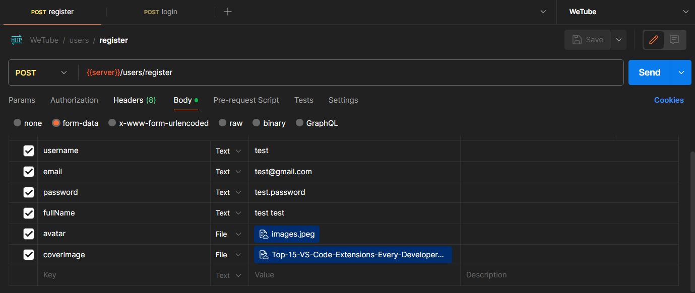
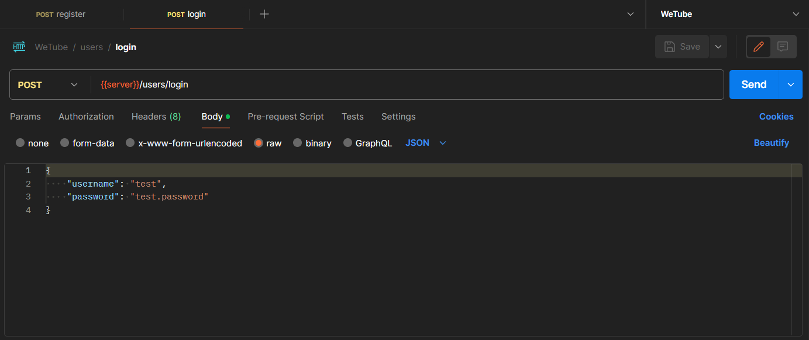

# 🎥 **WeTube**

WeTube is a robust backend server for video and post sharing. It utilizes MongoDB for data management, Cloudinary for media management, and Express.js for handling HTTP requests. It offers a wide range of features including authentication, video uploading, tweeting, likes, comments, playlists, subscriptions, and more.

### The server is currently running at [http://wetube.ap-south-1.elasticbeanstalk.com/api/v1](http://wetube.ap-south-1.elasticbeanstalk.com/api/v1).

## 🚀 How to Use the Deployed Server

#### To use the deployed server, you need to register or login first. <br/>


 <br/>

#### Once you are authenticated, you can send HTTP requests to the server URL. <br/>

The base URL for all requests is `http://wetube.ap-south-1.elasticbeanstalk.com/api/v1`.

For example, if you want to get a list of all videos, you might send a GET request to `http://wetube.ap-south-1.elasticbeanstalk.com/api/v1/videos`.

Please refer to the API documentation for more details on the available endpoints and how to use them.

## 📚 API Documentation

We have a Postman collection that you can use to explore the API. Follow these steps to import it into Postman:

1. Download the `WeTube.postman_collection.json` file from the repository.
2. Open Postman.
3. Click on the "Import" button.
4. Select the `WeTube.postman_collection.json` file.
5. After importing, you will see a "WeTube" collection in your Postman sidebar. Click on it to see the available requests.

**Note:**
In this document, `{{server}}` is used as a placeholder for the server URL.
You should replace it with your actual server URL, which is `http://wetube.ap-south-1.elasticbeanstalk.com/api/v1`.
`{{server}}` is defined as a global variable in the collection.

You can also view the API documentation online. Here's the link to the [WeTube Postman Documentation](https://github.com/AnikAdhikari7/WeTube/blob/main/WeTube.postman_collection.json).

## 🚀 Features

-   🔐 User Authentication
-   📹 Video Uploading
-   🐦 Tweeting
-   👍 Likes and Comments
-   🎵 Playlists
-   📬 Subscriptions
-   📊 Dashboard
-   🏥 Health Check

## 🛠️ Technologies Used

-   **MongoDB**: A source-available cross-platform document-oriented database program.
-   **Cloudinary**: A cloud-based image and video management service.
-   **Express.js**: A web application framework for Node.js, designed for building web applications and APIs.
-   **Bcrypt**: A library to help you hash passwords.
-   **Cookie-parser**: Parse Cookie header and populate `req.cookies` with an object keyed by the cookie names.
-   **Cors**: A node.js package for providing a Connect/Express middleware that can be used to enable CORS with various options.
-   **Dotenv**: A zero-dependency module that loads environment variables from a `.env` file into `process.env`.
-   **Jsonwebtoken**: An implementation of JSON Web Tokens.
-   **Mongoose**: An Object Data Modeling (ODM) library for MongoDB and Node.js.
-   **Mongoose-aggregate-paginate-v2**: A mongoose plugin to paginate aggregation results.
-   **Multer**: A node.js middleware for handling `multipart/form-data`, which is primarily used for uploading files.

## 🏁 Getting Started

These instructions will get you a copy of the project up and running on your local machine for development and testing purposes.

### 📋 Prerequisites

Before you begin, ensure you have met the following requirements:

-   🖥️ You have a recent version of **Node.js** installed. If not, you can download it from [here](https://nodejs.org/).
-   🧰 You have a package manager like **npm** (comes with Node.js) or **yarn** installed.
-   🛠️ You have **Git** installed. If not, you can download it from [here](https://git-scm.com/downloads).

## 🛠️ Installation & Set Up

1. 🔽 Clone the repository:

    ```bash
    git clone https://github.com/AnikAdhikari7/WeTube.git
    ```

2. 📂 Navigate into the directory:

    ```bash
    cd WeTube
    ```

3. 🌐 Install the dependencies:

    ```bash
    npm install
    ```

4. 🌿 Create a `.env` file and populate it with the necessary API keys and secrets:

    ```bash
    cp .env.example .env
    ```

    Open `.env` and replace the placeholders with your actual data.

5. 🚀 Run the application in development mode:
    ```bash
    npm run dev
    ```

## 🚀 Running the Application

After installing the dependencies, you can run the application using the following scripts defined in the `package.json` file:

-   To run the application in development mode, use:
    ```bash
    npm run dev
    ```
-   To start the application normally, use:
    ```bash
    npm start
    ```

## 🐳 Docker Usage

You can also run this application as a Docker container:

1. Pull the Docker image from Docker Hub:

    ```bash
    docker pull anikadhikari/wetube:latest

    ```

2. Run the Docker container:
    ```bash
    docker run --rm -d -p 8080:8080 --env-file ./.env --name <wetube-docker-container> anikadhikari/wetube:latest
    ```
    Replace `<wetube-docker-container>` with your desired container name. <br/>
    Replace `8080` with your desired port number.

-   To to know more about the docker image, visit the [Docker Hub](https://hub.docker.com/r/anikadhikari/wetube).

## 📄 License

This project is licensed under the MIT License - see the [LICENSE.md](LICENSE.md) file for details

## 🎉 Acknowledgments

-   Thanks to all contributors who have helped with pull requests and issues.

-   Thanks to all the developers who have created the libraries and tools used in this project.

-   Gratitude for the following resources that guided the development process:
    -   [Tutorial by Chai aur Javascript Backend](https://youtube.com/playlist?list=PLu71SKxNbfoBGh_8p_NS-ZAh6v7HhYqHW&si=yOimvgK66q6PCVyn) -> [GitHub Repo](https://github.com/hiteshchoudhary/chai-backend) for explaining how to set up a Node.js/Express.js server that too production grade level.
    -   [@hiteshchoudhary](https://github.com/hiteshchoudhary) for their helpful code snippets and solutions to issues.
